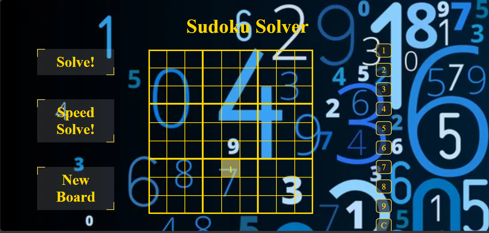

# Sudoku Solver 🧩

An interactive web-based Sudoku solver with a sleek golden interface and real-time validation. Built with vanilla HTML, CSS, and JavaScript.



## Features

- **Interactive Grid**: Click on any cell to input numbers 1-9
- **Number Pad**: Convenient on-screen number selection
- **Real-time Validation**: Instant feedback for duplicate numbers in rows, columns, or sub-grids
- **Automatic Solver**: Let the algorithm solve the puzzle for you
- **Speed Solve**: Quick solving without animations
- **Responsive Design**: Works seamlessly on desktop, tablet, and mobile devices
- **Visual Feedback**: Color-coded cells and animated warnings

## How to Use

1. **Input Numbers**: 
   - Click on a number from the number pad (1-9)
   - Click on any cell in the grid to place the number
   - Use "C" to clear a cell

2. **Get Help**:
   - **Solve!**: Automatically solves the entire puzzle with visual feedback
   - **Speed Solve!**: Instantly completes the puzzle
   - **New Board**: Clears the grid for a fresh start

3. **Visual Cues**:
   - 🟡 **Golden borders**: Define the 3x3 sub-grids
   - 🟨 **Yellow highlight**: Shows solved/placed numbers
   - 🔴 **Red warnings**: Alert you to duplicate numbers

## Installation

1. Clone the repository:
```bash
git clone https://github.com/Ashley-Programmer/sudoku-solver.git
cd prodigy_sd_03
```

2. Open `index.html` in your web browser

That's it! No build process or dependencies required.

## File Structure

```
prodigy_sd_03/
├── index.html          # Main HTML file
├── style.css           # Responsive CSS styling
├── index.js            # JavaScript logic and solver algorithm
├── images/
│   └── numbers3.jpg    # Background image
└── README.md           # This file
```

## Technical Details

### Algorithm
The solver uses a **backtracking algorithm** that:
1. Finds empty cells in the grid
2. Tries numbers 1-9 in each cell
3. Validates against Sudoku rules (no duplicates in rows, columns, or 3x3 sub-grids)
4. Recursively solves remaining cells
5. Backtracks when no valid number can be placed

### Responsive Design
- **Mobile-first approach** with CSS media queries
- **Flexible grid system** that adapts to screen size
- **Touch-friendly interface** optimized for mobile devices
- **Viewport units and clamp()** for fluid typography

### Browser Support
- ✅ Chrome 60+
- ✅ Firefox 55+  
- ✅ Safari 12+
- ✅ Edge 79+

## Customization

### Colors
Edit the CSS custom properties to change the color scheme:
```css
:root {
  --primary-gold: rgba(245, 219, 76, 0.904);
  --background-overlay: rgba(255, 255, 255, 0.123);
  --warning-color: red;
}
```

### Background
Replace `images/numbers3.jpg` with your preferred background image.

### Grid Size
The current implementation supports standard 9x9 Sudoku. To modify for different sizes, update the board array and grid generation logic in `index.js`.

## Contributing

1. Fork the repository
2. Create a feature branch (`git checkout -b feature/amazing-feature`)
3. Commit your changes (`git commit -m 'Add amazing feature'`)
4. Push to the branch (`git push origin feature/amazing-feature`)
5. Open a Pull Request

## License

This project is licensed under the MIT License - see the [LICENSE](LICENSE) file for details.

## Acknowledgments

- Backtracking algorithm implementation
- Responsive design principles
- CSS animations and transitions

---

**Enjoy solving Sudoku puzzles!** 🎯

*Made with ❤️ and lots of ☕*
